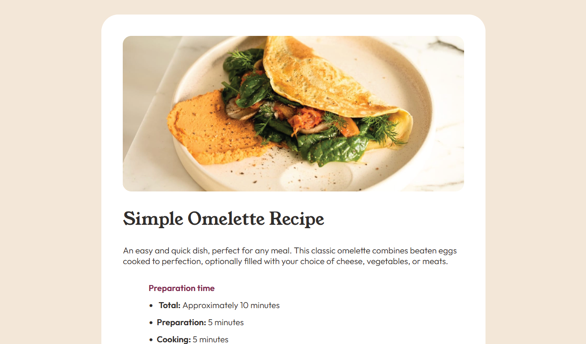

# 📰 Recipe Page

This is my fourth project from [Frontend Mentor](https://www.frontendmentor.io/).  
The task was to create a **recipe page** using basic HTML and CSS, and make it **responsive**.

## 🎯 Aim

The aim of this project was to practice:

- basic HTML structure
- intermediate CSS
- responsiveness and layout adjustments

## 🛠️ Used technologies

- **HTML5**
- **CSS3**

## 📸 Preview

